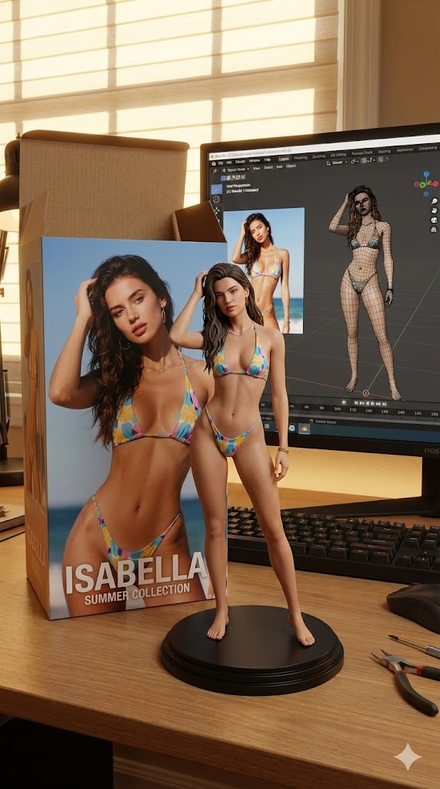

# 照片 → 角色手办展示场景

将一张真实照片转换为"角色手办 + 包装盒 + Blender
建模画面"的完整展示场景示例。

------------------------------------------------------------------------

## 📥 输入（Input）

------------------------------------------------------------------------

## 📤 输出（Output）

------------------------------------------------------------------------

## 🧩 Prompt

-   **英文 Prompt：**[`prompt.txt`](./prompt.txt)\
-   **中文 Prompt：**[`prompt_cn.txt`](./prompt_cn.txt)

------------------------------------------------------------------------

## 📄 示例说明

本示例展示如何通过模型生成一个完整的手办展示场景，包括：\
- 将人物转换为 **角色手办形象**\
- 在背后添加印有角色的 **包装盒**\
- 加入显示 Blender 建模过程的 **电脑屏幕**\
- 在前方放置 **圆形塑料底座** 承托手办\
- 场景尽量设置为 **室内环境**

适用于：手办展示图、衍生品设计、商品视觉概念稿。

------------------------------------------------------------------------
